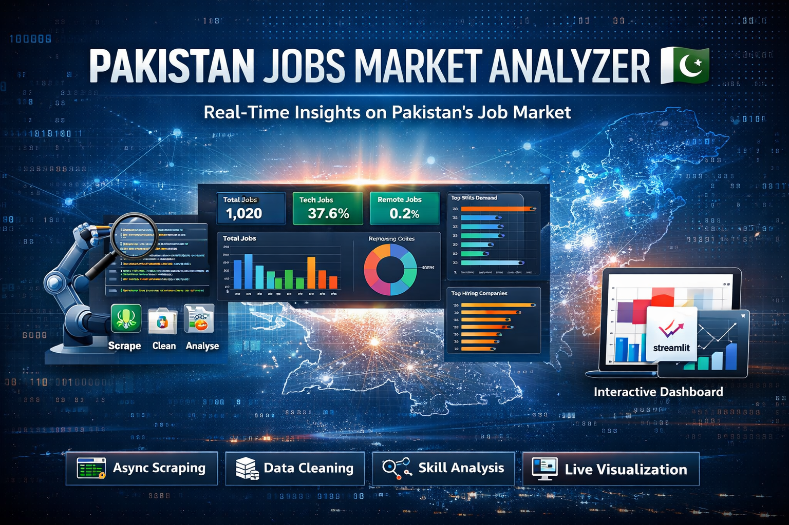
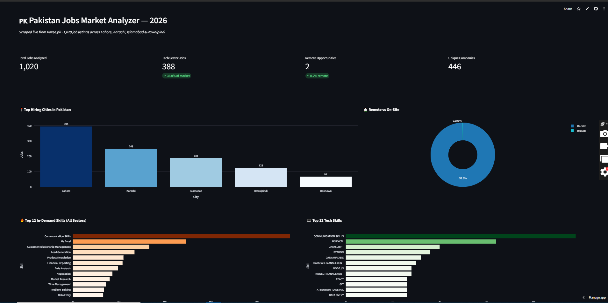

# Pakistan Jobs Market Analyzer 🇵🇰

<div align="center">



**A production-grade, end-to-end data platform that collects, processes, and analyzes real-time job market data in Pakistan using fully self-sourced datasets.**

<br/>

[](https://www.python.org/)
[](https://playwright.dev/python/)
[](https://pandas.pydata.org/)
[](https://plotly.com/)
[](https://streamlit.io/)

<br/>

[](https://pakistan-jobs-analyzer.streamlit.app/)

</div>

---

## 🚀 Overview

Most data science portfolios rely on static datasets. This project takes a **data engineering-first approach**, building a complete pipeline from raw web data to production-ready analytics.

> **Goal:** Extract real-time hiring intelligence from Pakistan’s job market.

This system answers:

- What skills are actually in demand right now?
- Which cities dominate hiring?
- How does tech hiring compare to non-tech?
- Which companies are actively recruiting?

---

## ✨ Core Features

- 🔄 End-to-end pipeline (Scraping → Cleaning → Analysis → Visualization)
- ⚡ Async scraping across 300+ dynamic pages
- 🧠 Fingerprint-based deduplication (title + company hashing)
- 📊 Interactive dashboard with real-time filters
- 🌍 Fully self-sourced dataset (no Kaggle dependency)
- 🧩 Modular, scalable architecture (production-style separation of concerns)

---

## 📸 Dashboard Preview



---

## 📊 Key Insights (April 2026)

| Metric               | Value      |
| -------------------- | ---------- |
| Total Jobs           | **1,020**  |
| Unique Companies     | **446**    |
| Tech Share           | **37.6%**  |
| Remote Jobs          | **0.2%**   |
| Top Hiring City      | **Lahore** |
| Most In-Demand Skill | **Python** |

---

## 🏗️ System Architecture

```
pakistan-jobs-analyzer/
│
├── scraper.py          # Async Playwright pipeline
├── cleaner.py          # Data cleaning & feature engineering
├── analyzer.py         # Terminal-based reporting
├── dashboard.py        # Streamlit dashboard
│
├── data/
│   ├── jobs_raw.csv
│   └── jobs_clean.csv
│
└── README.md
```

---

## ⚙️ Pipeline Breakdown (Deep Technical)

### 1️⃣ Scraping Layer — `scraper.py`

- Uses **Playwright async API** with headless Chromium
- Handles **JavaScript-rendered DOM**
- Iterates across:
  - 40+ keywords
  - 4 cities
  - 2 pagination offsets

- Implements:
  - Lazy-load triggering via scroll
  - Random delays to avoid rate limits
  - CSS selector-based extraction

**Deduplication Strategy:**

- Generates fingerprint: `(title + company).lower()`
- Stored in Python `set()`
- Prevents duplicate ingestion at source level

---

### 2️⃣ Data Processing — `cleaner.py`

Transforms raw scraped data into structured dataset:

- Title normalization (`str.title()`)
- Company cleaning (remove DOM artifacts)
- Location parsing (`Remote, Lahore → Lahore`)
- Skill normalization (synonym mapping)
- Intra-row deduplication using `set()`
- Global deduplication using composite key

**Feature Engineering:**

- `is_remote` → keyword detection (title + location)
- `is_tech` → regex-based classification using tech keywords

---

### 3️⃣ Analysis Layer — `analyzer.py`

- CLI-based reporting tool
- Computes:
  - Job distribution
  - Skill frequencies
  - City-level demand
  - Tech vs non-tech ratios

---

### 4️⃣ Visualization Layer — `dashboard.py`

- Built using **Streamlit + Plotly**
- Features:
  - KPI cards
  - City-level analysis
  - Skill demand charts
  - Company hiring leaderboard

**Interactive Controls:**

- City filter
- Tech vs Non-Tech filter
- Search (title + skills)

---

## 🧠 Design Decisions

**Why Playwright?**
Handles dynamic JavaScript content where traditional scraping fails.

**Why Async Architecture?**
Efficiently processes hundreds of page loads without blocking.

**Why Pre-ingestion Deduplication?**
Prevents duplicate data from corrupting downstream analytics.

**Why Dual-field Remote Detection?**
Captures inconsistencies in employer labeling.

---

## ⚠️ Data Limitations

- Single data source (Rozee.pk)
- Limited to major cities
- Skill tags depend on employer input
- Remote jobs underreported

---

## 🔮 Future Improvements

- Multi-platform scraping (LinkedIn, Indeed)
- NLP-based skill extraction from descriptions
- Salary analysis
- Automated scheduled pipelines (cron jobs)
- Time-series trend tracking

---

## 🧪 Running Locally

```bash
# Clone repo
git clone https://github.com/shakeel4451/pakistan-jobs-analyzer.git
cd pakistan-jobs-analyzer

# Install dependencies
pip install -r requirements.txt
playwright install chromium

# Run pipeline
python scraper.py
python cleaner.py
python analyzer.py
streamlit run dashboard.py
```

---

## 🛠️ Tech Stack

| Layer         | Technology |
| ------------- | ---------- |
| Scraping      | Playwright |
| Processing    | Pandas     |
| Visualization | Plotly     |
| Dashboard     | Streamlit  |

---

## 🎯 ATS / Recruiter Keywords

**Data Engineering:** Data Pipeline, ETL, Data Cleaning, Feature Engineering, Data Processing
**Web Scraping:** Playwright, Web Automation, Async Scraping, Headless Browser
**Data Science:** Pandas, Data Analysis, Data Visualization, Exploratory Data Analysis
**Backend Concepts:** Async Programming, Deduplication, Data Integrity, Scalable Systems
**Tools:** Python, Streamlit, Plotly, GitHub Deployment

---

## 👤 Author

**Muhammad Shakeel**
Python Developer · Data Engineer · Aspiring AI Engineer

---

## ⭐ Support

If you found this project valuable, consider giving it a ⭐ on GitHub.

---

## 📄 License

MIT License — for educational and portfolio use.
